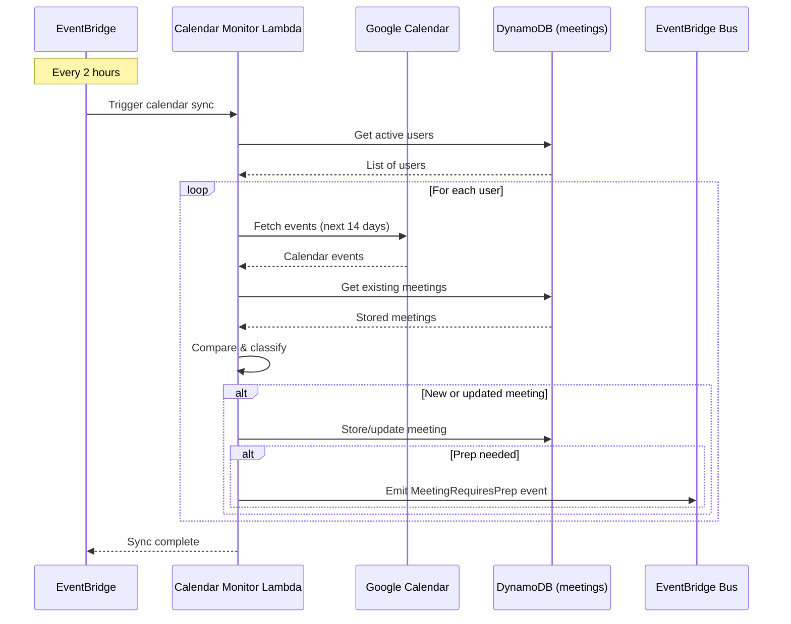
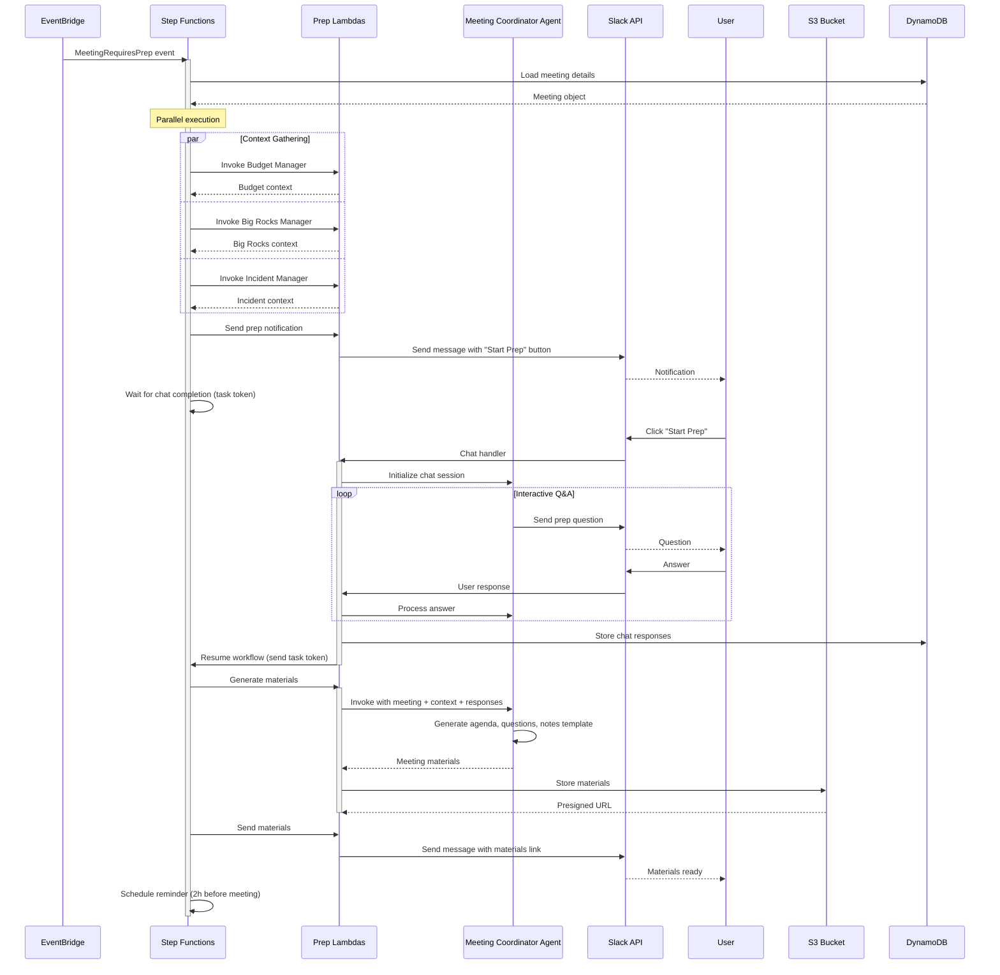
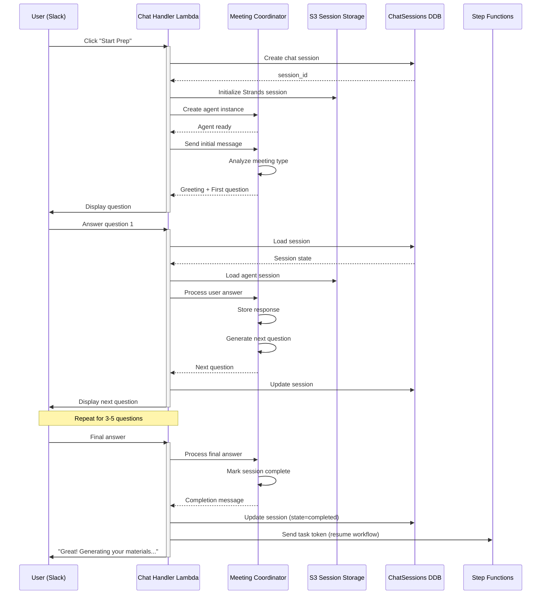
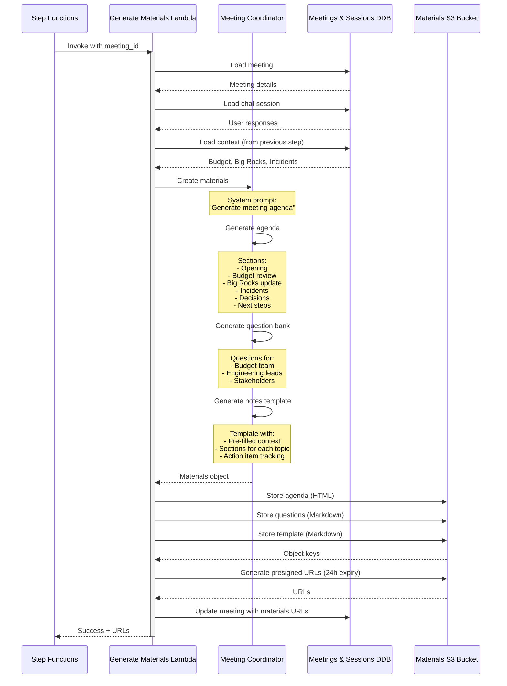
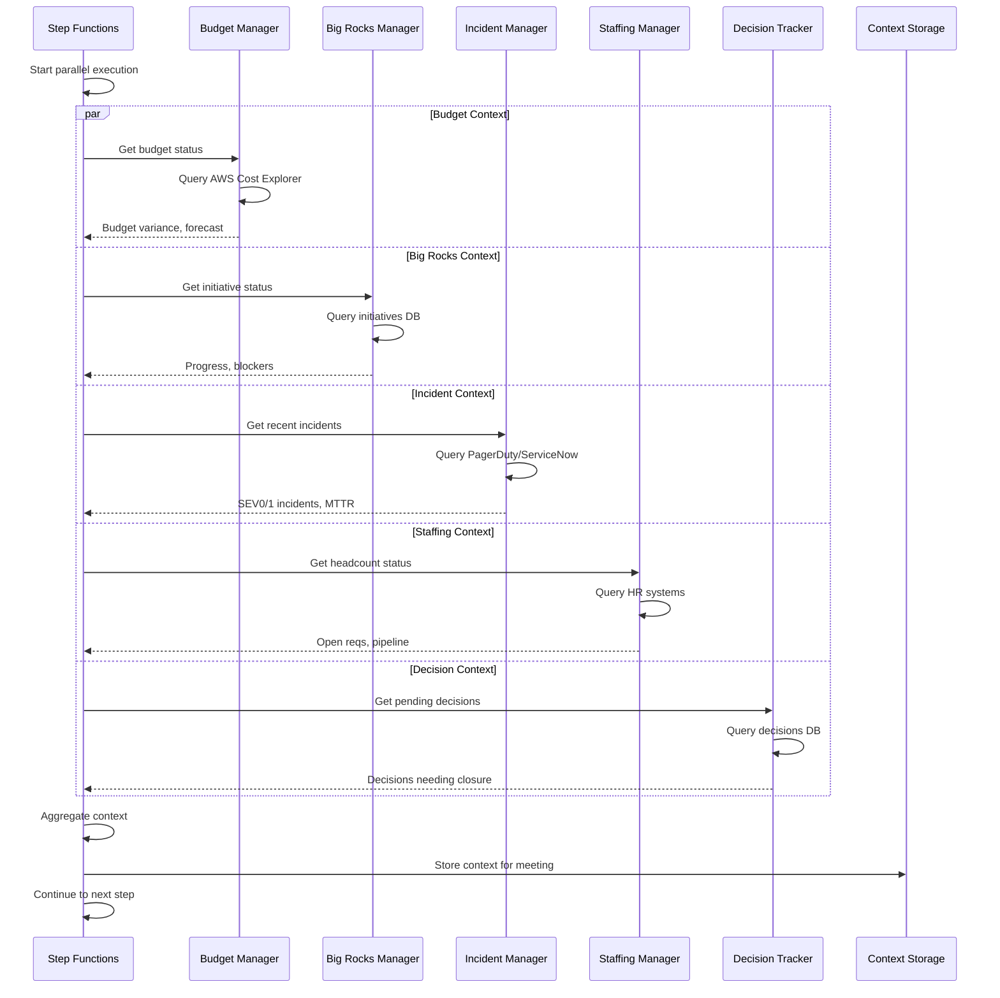

# Phase 3: Meeting Preparation Workflow

## Executive Summary

**Goal**: Implement the complete end-to-end meeting preparation workflow including calendar integration, scheduled monitoring, Step Functions orchestration, and proactive meeting prep notifications.

**Duration**: 3-4 weeks
**Complexity**: High (most complex phase)
**Value**: Core differentiator - proactive meeting preparation

## What's Been Completed

### Phase 1 (Foundation) ✅
- DynamoDB tables (meetings, chat_sessions, action_items, users)
- S3 buckets (documents, sessions)
- KMS encryption
- Data models and configuration
- Slack bot webhook handler (signature verification)

### Phase 1.5 (Authentication) ✅
- Google OAuth 2.0 integration
- JWT token generation and validation
- User management (DynamoDB users table)
- Web-based chat UI
- API Gateway with /auth endpoints

### Phase 2 (First Agent) ✅
- Meeting Coordinator agent using Strands SDK
- AWS Nova (Bedrock) model integration
- Agent chat handler Lambda (/chat/send endpoint)
- Interactive chat sessions
- Session persistence (S3 + DynamoDB)
- Local testing framework

## Phase 3 Overview

Phase 3 transforms the system from "chat with an agent" to "proactive meeting preparation assistant" by adding:

1. **Calendar Integration**: Connect to Google Calendar/Microsoft 365
2. **Calendar Monitor**: EventBridge scheduled task to poll calendar every 2 hours
3. **Meeting Classification**: Identify meeting types and calculate prep timing
4. **Step Functions Workflow**: Orchestrate the complete meeting prep flow
5. **Proactive Notifications**: Send prep notifications via Slack/SMS at optimal times
6. **Material Generation**: Create agendas, questions, and note templates
7. **Material Storage & Delivery**: Store in S3 and deliver via presigned URLs

## Architecture Diagram

```
┌─────────────────────────────────────────────────────────────────┐
│                    Phase 3 Architecture                          │
└─────────────────────────────────────────────────────────────────┘

┌──────────────────┐
│  Google Calendar │
│    / Office 365  │
└────────┬─────────┘
         │ OAuth 2.0
         │ Calendar API
         ▼
┌─────────────────────────────────────────────────────────────────┐
│  EventBridge Scheduled Rule (every 2 hours)                      │
└───────────────────────────┬─────────────────────────────────────┘
                            │
                            ▼
                  ┌──────────────────┐
                  │ Calendar Monitor │
                  │     Lambda       │
                  └─────────┬────────┘
                            │
         ┌──────────────────┼──────────────────┐
         │                  │                  │
         ▼                  ▼                  ▼
    ┌────────┐      ┌──────────────┐    ┌─────────┐
    │Meetings│      │Classification│    │EventBus │
    │DynamoDB│      │    Logic     │    │ Events  │
    └────────┘      └──────────────┘    └────┬────┘
                                              │
                         ┌────────────────────┘
                         │ Meeting needs prep
                         ▼
                ┌─────────────────────┐
                │  Step Functions     │
                │  Meeting Prep       │
                │  Workflow           │
                └──────────┬──────────┘
                           │
        ┌──────────────────┼──────────────────┐
        │                  │                  │
        ▼                  ▼                  ▼
  ┌──────────┐     ┌──────────────┐   ┌─────────────┐
  │ Context  │     │  Interactive │   │  Generate   │
  │Gathering │     │     Chat     │   │  Materials  │
  │ (Budget, │     │   Session    │   │  (Agenda,   │
  │  Big     │     │  (Slack/SMS) │   │  Questions) │
  │ Rocks)   │     │              │   │             │
  └──────────┘     └──────────────┘   └──────┬──────┘
                                             │
                                             ▼
                                      ┌─────────────┐
                                      │  S3 Bucket  │
                                      │  Materials  │
                                      └─────────────┘
```

## Phase 3 Components

### 3.1 Calendar Integration Module

**File**: `src/exec_assistant/shared/calendar.py`

**Responsibilities**:
- OAuth 2.0 flow (authorization code grant)
- Token storage and refresh (AWS Secrets Manager)
- Fetch upcoming meetings
- Parse meeting details (title, time, attendees, description)
- Create/update/delete meeting records

**APIs Supported**:
- Google Calendar API v3
- Microsoft Graph API (Outlook Calendar)

**Key Functions**:
```python
async def fetch_upcoming_meetings(
    user_id: str,
    days_ahead: int = 14,
) -> list[Meeting]:
    """Fetch upcoming meetings from calendar."""

async def get_meeting_details(
    meeting_id: str,
) -> Meeting:
    """Get detailed information about a specific meeting."""

async def refresh_calendar_token(
    user_id: str,
) -> str:
    """Refresh OAuth token for calendar access."""
```

**Configuration** (`config/calendar.yaml`):
```yaml
calendar:
  provider: "google"  # or "microsoft"
  oauth:
    scopes:
      - "https://www.googleapis.com/auth/calendar.readonly"
    redirect_uri: "${API_ENDPOINT}/calendar/callback"
  sync:
    days_ahead: 14
    days_behind: 1
  rate_limits:
    requests_per_minute: 100
```

---

### 3.2 Calendar Monitor Lambda

**File**: `src/exec_assistant/workflows/calendar_monitor.py`

**Trigger**: EventBridge scheduled rule (every 2 hours)

**Workflow**:
1. Fetch list of active users from DynamoDB users table
2. For each user:
   - Fetch calendar events (next 14 days)
   - Compare with existing meetings in DynamoDB
   - Identify new, updated, or cancelled meetings
3. Store/update meetings in DynamoDB meetings table
4. Emit EventBridge events for meetings requiring prep

**EventBridge Events Emitted**:
```json
{
  "DetailType": "MeetingRequiresPrep",
  "Source": "exec-assistant.calendar-monitor",
  "Detail": {
    "meeting_id": "uuid",
    "user_id": "google-oauth-id",
    "meeting_time": "2025-12-20T10:00:00Z",
    "prep_trigger_time": "2025-12-18T10:00:00Z",
    "meeting_type": "leadership_meeting"
  }
}
```

**Deduplication**: Use meeting external_id (calendar event ID) to avoid duplicates

---

### 3.3 Meeting Classification Logic

**File**: `src/exec_assistant/shared/meeting_classifier.py`

**Purpose**: Automatically classify meetings by type using configured rules

**Classification Rules** (from `config/meeting_types.yaml`):

```yaml
meeting_types:
  leadership_meeting:
    keywords:
      - "leadership"
      - "leadership team"
      - "LT meeting"
    required_attendees_min: 10
    prep_hours_before: 72  # 3 days

  one_on_one:
    keywords:
      - "1-1"
      - "1:1"
      - "one on one"
    attendee_count: 2
    prep_hours_before: 24  # 1 day

  qbr:
    keywords:
      - "QBR"
      - "quarterly business review"
    required_attendees_min: 20
    prep_hours_before: 336  # 2 weeks

  staff_meeting:
    keywords:
      - "staff meeting"
      - "all hands"
    required_attendees_min: 15
    prep_hours_before: 48  # 2 days

  incident_review:
    keywords:
      - "post-mortem"
      - "incident review"
      - "SEV"
    prep_hours_before: 2  # ASAP

  default:
    prep_hours_before: 24
```

**Classification Algorithm**:
1. Extract keywords from meeting title and description
2. Count attendees
3. Match against rules (keyword match + attendee count)
4. Return meeting type or "default" if no match
5. Calculate prep trigger time: `meeting_time - prep_hours_before`

---

### 3.4 Step Functions Workflow

**File**: `infrastructure/step_functions.py`

**Workflow Name**: `MeetingPrepWorkflow`

**Trigger**: EventBridge event (`MeetingRequiresPrep`)

**States**:

1. **LoadMeeting**: Fetch meeting details from DynamoDB
2. **GatherContext**: Parallel execution of context agents
   - Budget Manager
   - Big Rocks Manager
   - Incident Manager
   - Staffing Manager
   - Decision Tracker
3. **SendPrepNotification**: Send Slack/SMS notification
4. **WaitForChatCompletion**: Wait for interactive chat session
   - Uses Step Functions task token
   - Chat handler resumes workflow when user finishes
   - Timeout: 24 hours
5. **GenerateMaterials**: Invoke Meeting Coordinator agent
   - Input: Meeting + Context + Chat responses
   - Output: Agenda, questions, note template
6. **StoreMaterials**: Save to S3
7. **SendMaterials**: Deliver presigned URL via Slack
8. **ScheduleReminder**: Schedule final reminder (2 hours before)

**Error Handling**:
- Retry logic with exponential backoff
- Dead letter queue for failed workflows
- CloudWatch alerts for critical failures

---

## Sequence Diagrams

### Diagram 1: Calendar Sync Flow



### Diagram 2: Meeting Prep Workflow (Complete End-to-End)



### Diagram 3: Interactive Chat Session Detail



### Diagram 4: Material Generation Flow



### Diagram 5: Context Gathering (Parallel Execution)



## Implementation Tasks

### Sprint 1: Calendar Integration (Week 1)

**Goal**: Connect to calendar and fetch meetings

#### Task 1.1: Google Calendar OAuth Setup
- [ ] Create OAuth credentials in Google Cloud Console
- [ ] Implement authorization flow (`/calendar/auth` endpoint)
- [ ] Store tokens in AWS Secrets Manager
- [ ] Test token refresh logic

#### Task 1.2: Calendar API Integration
- [ ] Implement `calendar.py` module
- [ ] `fetch_upcoming_meetings()` function
- [ ] `get_meeting_details()` function
- [ ] Parse attendees, title, description, time
- [ ] Handle timezone conversions
- [ ] Write unit tests with mocked API

#### Task 1.3: Calendar-Meeting Model Mapping
- [ ] Convert calendar events to `Meeting` model
- [ ] Extract external_id (calendar event ID)
- [ ] Set meeting source ("google_calendar")
- [ ] Calculate duration
- [ ] Parse attendee emails and names

**Deliverable**: Can fetch meetings from Google Calendar and store in DynamoDB

**Success Criteria**:
- OAuth flow works end-to-end
- Meetings fetched and parsed correctly
- Token refresh automatic
- Tests passing

---

### Sprint 2: Calendar Monitor (Week 1-2)

**Goal**: Automated calendar polling with EventBridge

#### Task 2.1: Calendar Monitor Lambda
- [ ] Create `calendar_monitor.py` Lambda
- [ ] Implement user iteration logic
- [ ] Fetch calendar for each user
- [ ] Compare with stored meetings (detect changes)
- [ ] Handle errors gracefully (continue if one user fails)

#### Task 2.2: Meeting Classification
- [ ] Implement `meeting_classifier.py`
- [ ] Load rules from `config/meeting_types.yaml`
- [ ] Keyword matching algorithm
- [ ] Attendee count rules
- [ ] Calculate prep trigger time
- [ ] Write classification tests (each meeting type)

#### Task 2.3: DynamoDB Operations
- [ ] Store new meetings
- [ ] Update changed meetings
- [ ] Mark cancelled meetings
- [ ] Query by user + time range
- [ ] Add GSI if needed for queries

#### Task 2.4: EventBridge Integration
- [ ] Create EventBridge scheduled rule (every 2 hours)
- [ ] Emit `MeetingRequiresPrep` events
- [ ] Add event payload with meeting details
- [ ] Configure dead letter queue

**Deliverable**: Meetings automatically synced every 2 hours

**Success Criteria**:
- EventBridge rule triggers Lambda
- All users' calendars synced
- Meetings classified correctly
- Events emitted for upcoming meetings
- No failures for 24-hour test run

---

### Sprint 3: Step Functions Workflow (Week 2-3)

**Goal**: Orchestrate complete meeting prep flow

#### Task 3.1: Workflow Definition
- [ ] Create Step Functions state machine JSON
- [ ] Define all states (LoadMeeting, GatherContext, etc.)
- [ ] Configure error handling and retries
- [ ] Set timeouts for each state
- [ ] Deploy with Pulumi (`infrastructure/step_functions.py`)

#### Task 3.2: Context Gathering Lambdas
- [ ] Create placeholder context agents (return mock data):
  - Budget Manager
  - Big Rocks Manager
  - Incident Manager
  - Staffing Manager
  - Decision Tracker
- [ ] Implement parallel invocation
- [ ] Handle partial failures (continue with available context)
- [ ] Store aggregated context in DynamoDB

#### Task 3.3: Prep Notification Lambda
- [ ] Create `send_prep_notification.py`
- [ ] Format Slack message with meeting details
- [ ] Add "Start Prep" button
- [ ] Include Step Functions task token in button metadata
- [ ] Send via Slack API
- [ ] Fallback to SMS if Slack fails

#### Task 3.4: Task Token Handling
- [ ] Update chat handler to receive task token
- [ ] Store token with chat session
- [ ] Resume Step Functions when chat completes
- [ ] Handle timeout (24 hours)
- [ ] Test with real Step Functions execution

**Deliverable**: Complete workflow from event to notification

**Success Criteria**:
- Workflow triggered by EventBridge event
- Context gathered successfully
- Notification sent to user
- Workflow waits for chat completion
- Timeout handling works

---

### Sprint 4: Material Generation (Week 3)

**Goal**: Generate meeting prep materials with agent

#### Task 4.1: Update Meeting Coordinator Agent
- [ ] Enhance system prompt for material generation
- [ ] Add context interpolation in prompts
- [ ] Implement agenda generation logic
- [ ] Implement question bank generation
- [ ] Create note template with pre-filled context

#### Task 4.2: Generate Materials Lambda
- [ ] Create `generate_materials.py`
- [ ] Load meeting + context + chat responses
- [ ] Invoke Meeting Coordinator agent
- [ ] Parse agent output (agenda, questions, template)
- [ ] Format as HTML and Markdown
- [ ] Handle agent errors gracefully

#### Task 4.3: Material Storage
- [ ] Store materials in S3 documents bucket
- [ ] Organize by user_id/meeting_id/
- [ ] Generate presigned URLs (24-hour expiry)
- [ ] Update meeting record with URLs
- [ ] Implement cleanup (delete after 30 days)

#### Task 4.4: Material Delivery
- [ ] Create `send_materials.py` Lambda
- [ ] Format Slack message with links
- [ ] Include preview of agenda
- [ ] Add "View Materials" button
- [ ] Send to user via Slack DM

**Deliverable**: Users receive meeting prep materials

**Success Criteria**:
- Materials generated with relevant context
- Agenda includes user's priorities
- Questions reflect meeting type
- Materials accessible via URL
- Slack notification received

---

### Sprint 5: Testing & Refinement (Week 4)

**Goal**: End-to-end testing and bug fixes

#### Task 5.1: Integration Testing
- [ ] Test complete flow with real calendar
- [ ] Test all meeting types
- [ ] Test error scenarios (calendar down, agent timeout)
- [ ] Test concurrent workflows (multiple users)
- [ ] Performance testing (latency at each step)

#### Task 5.2: Prompt Refinement
- [ ] Iterate on agent prompts based on output quality
- [ ] A/B test different question sets
- [ ] Improve context formatting
- [ ] Add examples to prompts
- [ ] Test with real meeting data

#### Task 5.3: Error Handling
- [ ] Comprehensive error handling at each step
- [ ] User-friendly error messages
- [ ] Automatic retries where appropriate
- [ ] Alert on critical failures (SNS)
- [ ] Dead letter queue monitoring

#### Task 5.4: Monitoring & Observability
- [ ] CloudWatch dashboard for workflow metrics
- [ ] Alarms for high error rates
- [ ] X-Ray tracing enabled
- [ ] Custom metrics:
  - Meetings synced per run
  - Workflows completed
  - Chat completion rate
  - Material generation time
  - User satisfaction (optional feedback)

**Deliverable**: Production-ready Phase 3

**Success Criteria**:
- End-to-end test passes
- Error rate < 1%
- Average workflow completion < 30 seconds (excluding chat time)
- Monitoring dashboard operational
- No critical bugs

---

## Infrastructure Updates

### New Pulumi Resources

```python
# infrastructure/step_functions.py

import pulumi
import pulumi_aws as aws

def create_meeting_prep_workflow(
    environment: str,
    lambda_role: aws.iam.Role,
    tables: dict,
    buckets: dict,
) -> aws.sfn.StateMachine:
    """Create Step Functions workflow for meeting prep."""

    # Create Lambda functions for each step
    lambdas = {
        "load_meeting": create_load_meeting_lambda(...),
        "gather_context": create_gather_context_lambda(...),
        "send_notification": create_send_notification_lambda(...),
        "generate_materials": create_generate_materials_lambda(...),
        "send_materials": create_send_materials_lambda(...),
    }

    # Define state machine
    definition = {
        "Comment": "Meeting Preparation Workflow",
        "StartAt": "LoadMeeting",
        "States": {
            "LoadMeeting": {
                "Type": "Task",
                "Resource": lambdas["load_meeting"].arn,
                "Next": "GatherContext",
                "Retry": [...],
            },
            "GatherContext": {
                "Type": "Parallel",
                "Branches": [
                    {"StartAt": "BudgetContext", ...},
                    {"StartAt": "BigRocksContext", ...},
                    # ... other context agents
                ],
                "Next": "SendNotification",
            },
            # ... other states
        },
    }

    state_machine = aws.sfn.StateMachine(
        f"meeting-prep-workflow-{environment}",
        role_arn=...,
        definition=json.dumps(definition),
    )

    return state_machine
```

### EventBridge Rules

```python
# Calendar monitor (every 2 hours)
calendar_monitor_rule = aws.cloudwatch.EventRule(
    f"calendar-monitor-{environment}",
    schedule_expression="cron(0 */2 * * ? *)",
)

# Workflow trigger (on MeetingRequiresPrep event)
workflow_trigger_rule = aws.cloudwatch.EventRule(
    f"meeting-prep-trigger-{environment}",
    event_pattern=json.dumps({
        "source": ["exec-assistant.calendar-monitor"],
        "detail-type": ["MeetingRequiresPrep"],
    }),
)

aws.cloudwatch.EventTarget(
    f"meeting-prep-target-{environment}",
    rule=workflow_trigger_rule.name,
    arn=state_machine.arn,
    role_arn=events_role.arn,
)
```

### Secrets Manager

```python
# Store calendar OAuth tokens per user
calendar_token_secret = aws.secretsmanager.Secret(
    f"calendar-tokens-{environment}",
    description="OAuth tokens for calendar access",
    kms_key_id=kms_key.id,
)
```

---

## Configuration Updates

### `config/calendar.yaml` (NEW)

```yaml
calendar:
  provider: "google"
  sync_interval_hours: 2
  days_ahead: 14
  days_behind: 1

  google:
    scopes:
      - "https://www.googleapis.com/auth/calendar.readonly"
      - "https://www.googleapis.com/auth/calendar.events.readonly"
    api_version: "v3"

  microsoft:
    scopes:
      - "Calendars.Read"
      - "Calendars.Read.Shared"
    api_version: "v1.0"
```

### `config/meeting_types.yaml` (UPDATED)

Add prep questions for each meeting type:

```yaml
meeting_types:
  leadership_meeting:
    keywords: ["leadership", "leadership team", "LT meeting"]
    required_attendees_min: 10
    prep_hours_before: 72
    prep_questions:
      - "What are your top 3 priorities for this meeting?"
      - "Any incidents or reliability concerns from this week?"
      - "Budget variances to address?"
      - "Staffing updates or concerns?"
      - "Decisions needed from the group?"
    context_required:
      - budget
      - big_rocks
      - incidents
      - staffing
      - decisions
```

---

## Testing Strategy

### Unit Tests

```python
# tests/test_calendar.py
def test_fetch_upcoming_meetings():
    """Test calendar API integration."""

def test_oauth_token_refresh():
    """Test token refresh logic."""

# tests/test_meeting_classifier.py
def test_classify_leadership_meeting():
    """Test classification of leadership meeting."""

def test_calculate_prep_trigger():
    """Test prep timing calculation."""

# tests/test_step_functions.py (mocked)
def test_workflow_state_transitions():
    """Test workflow progresses through states."""
```

### Integration Tests

```python
# tests_integ/test_calendar_integration.py
@pytest.mark.integration
async def test_real_calendar_fetch():
    """Test with real Google Calendar API."""
    # Requires test calendar with known events

# tests_integ/test_workflow_integration.py
@pytest.mark.integration
async def test_complete_workflow():
    """Test end-to-end workflow execution."""
    # Uses real AWS resources (dev environment)
```

### End-to-End Tests

```python
# tests_integ/test_e2e_meeting_prep.py
@pytest.mark.e2e
async def test_meeting_prep_flow():
    """
    Complete flow:
    1. Add meeting to test calendar
    2. Wait for calendar sync
    3. Verify notification sent
    4. Simulate chat interaction
    5. Verify materials generated
    6. Cleanup
    """
```

---

## Deployment Strategy

### Phase 3.1: Calendar Integration (Week 1)
```bash
# Enable Phase 3.1
cd infrastructure
pulumi config set exec-assistant:enable_phase_3_calendar true
pulumi up
```

### Phase 3.2: Calendar Monitor (Week 2)
```bash
# Enable calendar monitoring
pulumi config set exec-assistant:enable_calendar_monitor true
pulumi up
```

### Phase 3.3: Step Functions (Week 3)
```bash
# Enable full workflow
pulumi config set exec-assistant:enable_meeting_prep_workflow true
pulumi up
```

### Rollback Plan

If Phase 3 needs to be rolled back:

```bash
# Disable all Phase 3 features
pulumi config set exec-assistant:enable_phase_3_calendar false
pulumi config set exec-assistant:enable_calendar_monitor false
pulumi config set exec-assistant:enable_meeting_prep_workflow false
pulumi up
```

EventBridge rules will be removed, Step Functions deleted, but data preserved in DynamoDB.

---

## Success Metrics

### Technical Metrics
- **Calendar Sync Success Rate**: > 99%
- **Meeting Classification Accuracy**: > 95%
- **Workflow Completion Rate**: > 98%
- **Chat Completion Rate**: > 70%
- **Material Generation Time**: < 10 seconds
- **End-to-End Latency** (event to notification): < 30 seconds

### User Metrics
- **Prep Adoption Rate**: > 60% of meetings prepped
- **User Satisfaction**: NPS > 50
- **Time Saved**: 15+ minutes per meeting
- **Material Usefulness**: 4+ stars (5-star scale)

### Business Metrics
- **Meeting Effectiveness**: Decisions per meeting increased
- **Action Item Completion**: Higher completion rate
- **Strategic Alignment**: Big Rocks progress improved

---

## Risk Assessment

| Risk | Probability | Impact | Mitigation |
|------|-------------|--------|------------|
| Calendar API rate limits | Medium | High | Implement caching, batch requests, request quota increase |
| Step Functions cost overruns | Low | Medium | Use Express workflows, optimize execution time |
| Agent response quality poor | Medium | High | Iterate on prompts, A/B testing, user feedback loop |
| OAuth token expiration issues | Medium | Medium | Proactive token refresh, user notifications |
| Workflow timeout (user doesn't respond) | High | Low | 24-hour timeout, reminder notifications, graceful degradation |
| Calendar permission revoked | Low | High | Detect and notify user, graceful degradation |
| Concurrent workflow limits | Low | Medium | Request Step Functions quota increase, queue if needed |

---

## Post-Phase 3 Roadmap

### Phase 4: Post-Meeting Processing
- Meeting notes upload (voice/text)
- Action item extraction
- Decision logging
- Meeting summary distribution

### Phase 5: Real Context Agents
- Budget Manager (AWS Cost Explorer integration)
- Incident Manager (PagerDuty/ServiceNow integration)
- HR Manager (1-1 tracking, performance reviews)

### Phase 6: Advanced Features
- Multi-calendar support (personal + work)
- Meeting outcome tracking
- ML-based prep timing optimization
- Voice interface for prep

---

## Appendix

### A. Calendar API Comparison

| Feature | Google Calendar | Microsoft Graph |
|---------|----------------|-----------------|
| API Maturity | Excellent | Excellent |
| Rate Limits | 1M requests/day | Variable by license |
| OAuth Flow | Standard | Standard |
| Event Details | Rich | Rich |
| Attendee Info | Full | Full |
| Recurring Events | Supported | Supported |
| Timezone Handling | Excellent | Good |

**Recommendation**: Implement Google Calendar first (Phase 3), add Microsoft support in Phase 4.

### B. Step Functions vs. Lambda Orchestration

**Step Functions Advantages**:
- Visual workflow representation
- Built-in error handling and retries
- State persistence
- Easy to modify workflow
- Scalable without code changes

**Lambda Orchestration Advantages**:
- Lower cost for simple flows
- Faster execution
- More flexible control flow

**Decision**: Use Step Functions for meeting prep workflow due to complexity and need for human-in-the-loop (chat session wait state).

### C. Material Format Examples

**Agenda Format** (HTML):
```html
<h1>Leadership Team Meeting - Dec 20, 2025</h1>
<h2>10:00 AM - 11:30 AM</h2>

<h3>Agenda</h3>
<ol>
  <li><strong>Opening</strong> (5 min)
    <ul>
      <li>Quick wins from the week</li>
    </ul>
  </li>
  <li><strong>Budget Review</strong> (15 min)
    <ul>
      <li>Variance: +$45K in compute (over budget)</li>
      <li>Action: Investigate spike in EC2 usage</li>
    </ul>
  </li>
  <!-- ... more sections ... -->
</ol>
```

---

## Questions Before Starting Phase 3

1. **Calendar Provider**: Confirm Google Calendar or Microsoft 365?
2. **Notification Preference**: Slack primary, SMS fallback? Or SMS always included?
3. **Prep Timing**: Are the default hours (24-72) appropriate, or adjust per user?
4. **Context Agents**: Which context is highest priority to implement first?
5. **User Pilot**: Who are the first 5 users for Phase 3 testing?
6. **Budget**: Estimated AWS costs increase ~$50-100/month - approved?

---

**Document Version**: 1.0
**Created**: 2025-12-19
**Author**: Development Team
**Status**: Ready for Review
